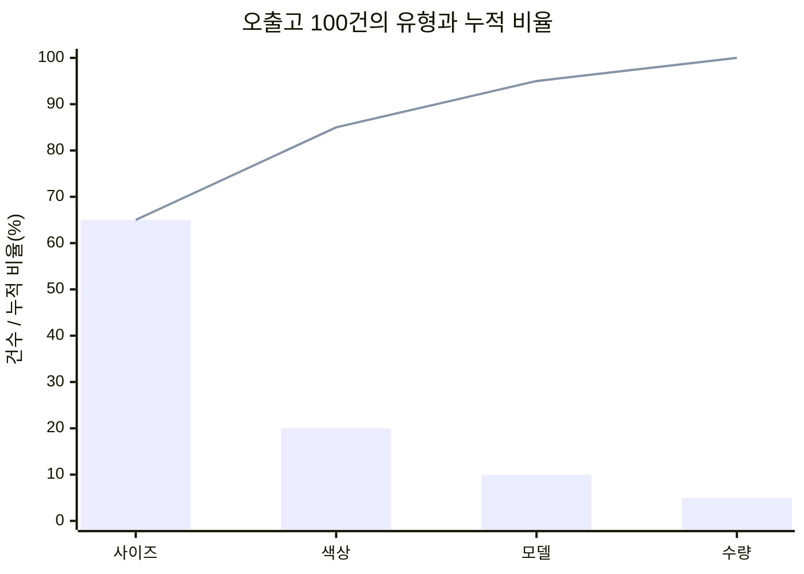
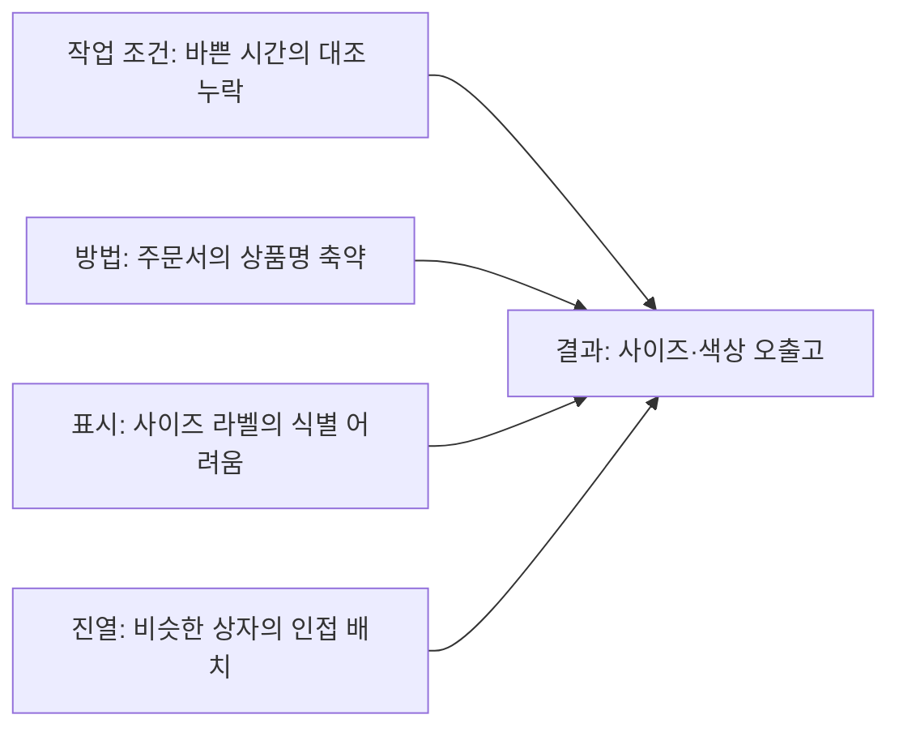
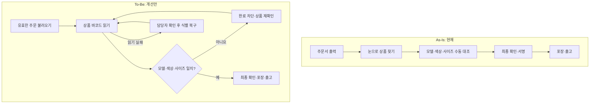
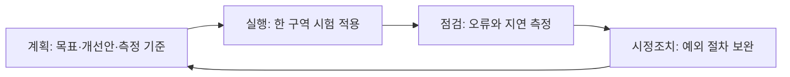
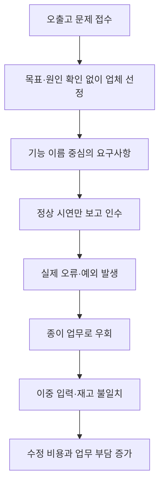

# 서사

IT 비즈니스의 정의 설명

- IT 비즈니스 == 기존 비즈니스(산업)의 문제를 IT로 해결

문제의 정의설명

- 문제 == 이상적인 미래의 상태와 현재의 상태간 차이
  - 개발에서 많이 나오는 용어, 오해하면 안되요.

IT 담당자가 되어 봅시다
지금부터 하는 말은 “당연한 거 아니야?”라고 생각하시면 안 됩니다.
모든 안전 수칙이 피로 쓰여지듯이, 지금 말씀드리는 지침은 IT 산업계가 엄청난 손해를 보면서 피와 눈물로 알아낸 지식입니다.

### 사례 1. FBI: 현대적인 시스템을 만들자고 했지만, 무엇을 만들어야 하는지 충분히 정하지 않았다

미국 연방수사국(FBI)은 수사관들이 종이로 기록을 만들고 승인을 받은 뒤 전산에 올리는 번거로운 업무를 개선하려고 했습니다. 정보를 직접 입력하고 전자 승인을 받아 공유할 수 있는 사건관리 시스템 VCF를 만들려는 것이었습니다.

그런데 2001년 외부 업체 SAIC와 처음 계약할 때, 시스템이 해야 할 일을 완전하게 정의하지 않은 상태였습니다. 이는 2005년 FBI 국장이 의회에서 직접 인정한 내용입니다. ‘현대적인 사건관리 시스템이 필요하다’는 방향은 있었지만, 그것을 구체적인 요구사항으로 충분히 정리하기 전에 계약을 진행한 것입니다.

2003년 국장은 시연을 보고 좋은 인상을 받았지만, 실제 납품된 시스템은 사용할 수 없는 상태였습니다. 추가 검토에서 약 400개의 문제가 발견됐습니다. 업체는 수정과 전체 기능 제공에 추가로 5,600만 달러와 1년이 필요하다고 했고, FBI는 받아들일 수 없다고 판단했습니다.

2005년 국장은 약 1억 7,000만 달러 규모의 투자에서 재사용 가능한 장비·서비스와 미집행 금액을 제외한 손실을 **1억 450만 달러**로 설명했습니다. VCF 사업은 결국 중단됐습니다.

**‘IT를 도입해 효율을 높이자’는 방향만으로는 충분하지 않습니다. 어떤 업무가 어떻게 달라져야 하는지, 시스템이 무엇을 해야 하는지 구체화해야 합니다.**

이 사건은 요구사항 미정의 외에도 관리 역량 부족, 담당자 교체, 기존 시스템과의 연계 복잡성 등이 함께 작용했습니다. ‘목표가 전혀 없었다’거나 ‘막연한 목표 하나 때문에 실패했다’고 단정하는 사례는 아닙니다.

출처: [FBI 국장의 2005년 의회 증언](https://archives.fbi.gov/archives/news/testimony/fbis-virtual-case-file-system), [미 법무부 감찰관의 후속 사업 감사 요약](https://oig.justice.gov/archives/reports/FBI/a0614/exec.htm)

### 외부 IT 용역을 맡기는 회사의 입장

‘전문가들이니까 알아서 잘해 주겠지’라고 생각하며 가만히 있어서는 안 됩니다. 우리 회사가 이루려는 목표, 현재 업무 방식과 문제를 적극적으로 설명하고, 업체가 제안한 해결책이 실제 업무에 맞는지 함께 확인해야 합니다. 개발을 맡겼다고 해서 문제를 설명하고 결과를 확인할 책임까지 넘길 수는 없습니다.

### 일을 맡은 IT 업체 직원의 입장

‘고객이 요구사항을 알아서 정리해 주겠지’라고 기다려서는 안 됩니다. 고객의 업무를 집요하게 파고들어, 어떤 목표가 있고 현재 무엇이 그 목표를 가로막는지 함께 파악해야 합니다. 고객이 요청한 기능만 받아 적는 데서 끝내지 말고, 그 기능이 왜 필요한지, 실제로 해결해야 할 문제가 무엇인지 확인해야 합니다.

### 기존 산업을 구식으로 여기고 해결사를 자처해서는 안 된다

IT 비즈니스에 종사하면서 경계해야 할 태도가 있습니다. 비 IT 업계를 구식으로 여기고, 자신을 그 업계를 선진화해 줄 해결사로 착각하는 것입니다. ‘기존 프로세스는 구닥다리니까 싹 갈아엎고 우리가 재설계해 주겠다’는 태도입니다.

이런 태도는 기존 프로세스가 만들어진 역사를 간과합니다. 그 안에는 수많은 실패와 사고, 손실, 현장의 피와 땀과 눈물이 담겨 있을 수 있습니다. 업계에서 기업들이 문을 닫고, 남은 기업들이 치열한 경쟁 속에서 살아남으려고 보완하고 또 보완해 온 경험이 축적되어 있습니다. 기존 프로세스는 그 과정에서 만들어진 귀중한 지식이기도 합니다.

그 산업을 직접 경험하지도, 현장을 충분히 이해하지도 못한 외부 IT 전문가가 이 모든 것을 버리고 새로 설계하겠다고 나서면, 기존 절차가 막아 주던 사고와 손실까지 되살릴 수 있습니다. 기술을 안다는 이유만으로 그 산업의 업무까지 더 잘 안다고 생각해서는 안 됩니다.

**기존 프로세스가 왜 그렇게 만들어졌는지 먼저 이해해야 합니다. 그 안에서 목표 달성을 가로막는 문제를 찾아, 현업과 함께 개선해야 합니다.** 전체 재설계가 필요한 경우에도 이러한 이해와 검증을 건너뛰어서는 안 됩니다.

### 참고: 개발에서도 기존 코드를 쉽게 버리려 해서는 안 된다

후임 개발자가 전임자의 코드를 보고 ‘별로네요. 현대적인 방식이 아니니 다시 짜야겠습니다’라고 쉽게 평가할 수 있습니다. 이해하기 어려운 코드를 읽기보다, 자신이 아는 방식으로 처음부터 새로 만들고 싶은 유혹에 빠질 수 있습니다.

하지만 기존 코드에는 실제 운영 중 발견한 버그와 예외 상황을 해결한 경험이 담겨 있을 수 있습니다. 왜 필요한지 이해하지 못한 코드를 버리면, 과거에 이미 해결했던 문제를 다시 겪게 될 수 있습니다. **낡아 보인다는 이유만으로 전면 재작성을 선택하면 최악의 선택이 될 수 있습니다.**

#### 사례: 넷스케이프 브라우저의 전면 재작성

조엘 스폴스키는 2000년 글 「Things You Should Never Do, Part I」에서 넷스케이프의 브라우저 전면 재작성을 비판했습니다. 그는 재작성 과정의 긴 출시 공백이 경쟁사에 시간을 내주었으며, 오래된 코드에 축적된 버그 수정의 가치를 버리는 것이 위험하다고 설명했습니다.

이는 넷스케이프의 실패에 대한 스폴스키의 분석입니다. 모든 재작성이 실패한다거나, 넷스케이프의 쇠퇴 원인이 재작성 하나뿐이었다는 뜻은 아닙니다. 수업에서 강조할 점은 **기존 코드의 역할과 축적된 경험을 이해하기 전에 ‘전부 다시 만들자’고 판단하지 말아야 한다**는 것입니다.

※ 앞서 떠올린 MySQL 사례는 확인되지 않아, 출처가 확인되는 넷스케이프 사례로 소개합니다.

[출처: Joel Spolsky, Things You Should Never Do, Part I](https://www.joelonsoftware.com/2000/04/06/things-you-should-never-do-part-i/)

## 성공 스토리: 반품 상자 앞에서

> 나이키 같은 신발 판매기업을 가정한 1인칭 학습 소설입니다. 회사·인물·수치·사건은 허구이며, 실제 나이키나 FBI가 아래 기법을 사용했다는 뜻은 아닙니다. 문제를 푸는 방법은 교재에서 가져왔습니다.

나는 신발 판매기업의 IT 담당자다. 월요일 아침, 고객지원팀장이 반품 상자를 들고 찾아왔다.

“주문한 것과 다른 신발이 자꾸 가요. 창고 시스템을 바꿔 주세요.”

나는 시스템 이름부터 찾는 대신 물었다.

“얼마나 자주 발생하죠? 어느 수준까지 줄여야 합니까?”

우리는 다음 분기까지 오출고율을 2퍼센트에서 0.5퍼센트 이하로 줄이되, 출고 지연은 늘리지 않기로 했다. 나는 내부 IT팀에 현업과 함께 현황을 분석해 달라고 요청했다.

내가 회의에서 합의한 기준은 세 줄이었다.

| 구분 | 확인·합의한 내용 |
| --- | --- |
| 현재 | 지난 분기 출고 5,000건 중 오출고 100건: 2% |
| 목표 | 다음 분기 오출고율 0.5% 이하 |
| 함께 지킬 조건 | 약속한 날짜를 넘긴 출고 비율은 현재 5%보다 늘리지 않는다. |

오출고율은 ‘오출고 건수 ÷ 전체 출고 건수’로 계산하기로 했다. 기간과 집계 기준도 같게 맞췄다.
팀원은 최근 오출고 100건을 유형별로 집계했다. 사이즈 오류가 65건, 색상 오류가 20건, 나머지는 다른 모델과 수량 오류였다. 많은 순서대로 막대를 세우고 누적 비율을 그리자, 어디부터 살펴봐야 할지 보였다. 교재에서 본 **파레토 차트**였다.

“사이즈와 색상이 85건이네요. 여기를 먼저 보죠.”
내 화면에 띄운 파레토 분석은 이랬다. 이번 자료는 전체 오류가 100건이므로 건수와 백분율의 숫자가 같다. 막대는 발생 건수, 선은 누적 비율이다.

| 오류 유형 | 건수 | 비율 | 누적 비율 |
| --- | ---: | ---: | ---: |
| 사이즈 | 65 | 65% | 65% |
| 색상 | 20 | 20% | 85% |
| 다른 모델 | 10 | 10% | 95% |
| 수량 | 5 | 5% | 100% |

나는 빈도가 높은 사이즈·색상 오류부터 조사하기로 했다. 빈도가 낮더라도 피해가 큰 오류는 별도로 살펴봐야 했다.

우리는 창고로 내려갔다. 그런데 그래프는 무엇이 많은지만 알려줄 뿐, 왜 생기는지는 알려주지 않았다. 나는 창고 직원들과 **원인-결과 다이어그램**을 그렸다. 작업자, 작업 방법, 라벨, 진열 위치에 걸쳐 가능한 원인을 적고 실제 작업과 대조했다.

회의에서 그린 원인-결과 다이어그램을 가지별로 정리했다. 아직 원인으로 확정한 것이 아니라, 현장에서 확인할 가설이었다.

| 원인 후보 | 확인 방법 |
| --- | --- |
| 주문서 정보 부족 | 실제 주문서와 주문 원본의 모델·색상·사이즈 대조 |
| 상자 식별 어려움 | 작업자와 함께 상자를 고르며 라벨과 진열 위치 관찰 |
| 확인 누락 | 바쁜 시간과 한산한 시간의 실제 작업 관찰 |

비슷한 상자가 붙어 있었고, 종이 주문서에는 상품명이 줄여 적혀 있었다. 바쁜 시간에는 사이즈까지 대조하기 어려웠다. 마지막 확인 서명은 그 실수를 막으려고 생긴 절차였다.

“서명을 없애기 전에, 잘못 집어도 통과되는 이유를 고쳐야겠네요.”

나는 주문 접수부터 포장까지 **현재 업무 흐름인 As-Is**를 그렸다. 이어 **개선할 흐름인 To-Be**에는 상품의 모델·색상·사이즈를 바코드로 확인하고, 주문과 다르면 포장을 완료할 수 없게 하는 과정을 넣었다. 라벨과 진열 방식도 함께 바꿨다. 프로그램만 고치는 것이 아니라 업무와 정보의 흐름을 개선하는 **PI, 프로세스 혁신**이었다.

나는 두 흐름을 나란히 놓고 창고 반장에게 빠진 일이 없는지 물었다.

“확인 자체를 없애지는 않겠습니다. 먼저 오류를 잡는 기능이 제대로 작동하는지 보죠.”
이제 구현 방법을 골랐다. 내부 IT팀은 주문 시스템을 수정할 수 있었지만 창고용 단말 프로그램을 처음부터 만들 여력은 없었다. 이미 판매되는 패키지를 시험해 보니 바코드 검증 기능은 쓸 만했다. 우리는 내부 개발과 패키지를 결합하는 **하이브리드 방식**을 선택했다.

| 선택지 | 우리 회사에서 따져 본 점 | 결정 |
| --- | --- | --- |
| 인하우스 개발 | 주문 시스템은 수정 가능하지만 단말까지 만들 인력이 부족하다. | 전체 자체 개발은 보류 |
| 패키지 도입 | 검증 기능은 있지만 기존 주문 시스템과 연결이 필요하다. | 기본 기능 활용 |
| 하이브리드 | 패키지를 쓰면서 내부 주문 수정과 외부 연결 개발을 결합한다. | 채택 |

제품을 사는 방식과 일을 맡기는 대상은 별개였다. 내부 IT팀은 주문 시스템을, 외부 업체는 연결 개발을 맡고, 현업은 업무 기준과 시험에 참여했다.
외부 업체에 맡길 연결 작업은 **제안요청서**에 적었다. ‘창고를 디지털화해 주세요’ 대신 정상 상품, 다른 사이즈, 취소된 주문을 각각 스캔했을 때 어떻게 동작해야 하는지 써 두었다. 업체 평가와 인수 시험에서도 그 조건을 확인하기로 했다.

내가 준비한 제안요청서의 일부다. 업체에는 구현 방법·일정·비용·지원 방안도 제안해 달라고 요청했다.

| 항목 | 요청 내용 | 인수 때 확인할 장면 |
| --- | --- | --- |
| 사업 목적 | 오출고율 감소, 출고 지연 악화 방지 | 운영 효과는 시험 운영 후 별도 측정 |
| 상품 대조 | 모델·색상·사이즈가 주문과 일치해야 완료 가능 | 다른 사이즈 상자를 읽으면 완료가 막히는가? |
| 취소 처리 | 취소 주문은 출고 불가 | 취소된 주문을 불러와도 진행이 막히는가? |
| 판독 실패 | 읽히지 않는 바코드를 무조건 통과시키지 않음 | 담당자가 확인하고 식별을 복구할 수 있는가? |
| 이력 | 작업 시각·상품·주문·처리자를 기록 | 문제 주문의 처리 이력을 찾을 수 있는가? |
| 범위 | 지정 창고의 주문 연계와 상품 검증 | 다른 창고 확대는 이번 계약에 포함되지 않음 |

같은 시험 장면과 가격·일정·유지보수 조건으로 제안을 비교했다. 기능 시연만 보고 계약하지 않았다. 개발 중에도 그 조건을 함께 확인했고, 인수 시험에서는 정상 주문뿐 아니라 잘못된 상품과 취소 주문도 실제로 넣어 봤다.
첫 시험 날, 직원들은 시스템이 느리다며 종이로 돌아가려 했다. 나는 사용법을 다시 공지하는 대신 작업대 앞에 섰다. 장갑을 낀 채 작은 버튼을 여러 번 눌러야 했다.

현장 직원과 화면을 수정하고, 교대조별로 실제 주문을 처리하며 교육했다. 변화의 이유를 공유하고 새 방식에 적응하도록 돕는 **변화관리**가 필요했다.

한 구역에서 시험한 뒤, 오출고율과 출고 시간을 다시 확인했다. 오출고는 줄었지만 바코드가 훼손된 상자에서 대기가 길어졌다. 예외 처리 절차를 보완하고 다시 시험했다. **계획–실행–점검–시정조치, PDCA**가 보고서의 네 칸이 아니라 우리가 일하는 순서가 됐다.

시험 구역의 오출고율이 0.4퍼센트로 낮아지고 출고 지연도 늘지 않은 것을 확인한 뒤, 적용 범위를 넓히기로 했다.

| 같은 기준으로 집계한 지표 | 도입 전 분기 | 시험 구역의 평가 기간 | 판단 |
| --- | ---: | ---: | --- |
| 오출고율 | 100 / 5,000 = 2% | 20 / 5,000 = 0.4% | 목표 0.5% 이하 달성 |
| 출고 지연율 | 250 / 5,000 = 5% | 240 / 5,000 = 4.8% | 악화되지 않음 |

기간별 상품 구성과 작업량 차이도 살펴봤다. 이 결과만으로 모든 창고에서 같은 효과가 난다고 단정하지는 않았다.
고객지원팀장이 반품 집계를 가리켰다.

“결국 무슨 시스템을 도입한 거예요?”

나는 처음 받았던 요청을 떠올렸다.

“시스템도 바꿨지만, 잘못된 신발이 출고되는 과정을 함께 고친 겁니다.”

### 교재 연결

- 파레토 차트·원인-결과 다이어그램: 본문 74쪽, PDF 76쪽. 교재에서 통계적 공정관리의 분석 도구로 소개한다. 소설에서는 오류 유형과 원인 분석에 활용했으며, 이것만으로 통계적 공정관리 전체를 수행했다는 뜻은 아니다.
- PI와 As-Is/To-Be: 본문 68~69쪽, PDF 70~71쪽.
- 인하우스·패키지·하이브리드 도입: 본문 54~55쪽, PDF 56~57쪽.
- 제안요청서·공급자 평가·인수 시험: 본문 51~52쪽, PDF 53~54쪽.
- 변화관리: 본문 70쪽, PDF 72쪽.
- PDCA: 본문 23쪽, PDF 25쪽.

## 실패 스토리: 검수 완료

> 앞의 성공 스토리와 같은 신발 판매기업의 문제를 다르게 처리했을 때를 보여주는 가상 이야기입니다. 인물·사건·수치는 모두 창작입니다.

나는 신발 판매기업의 IT 담당자다. 고객지원팀장이 반품 상자를 들고 왔다.

“주문한 것과 다른 신발이 자꾸 가요. 창고 시스템을 바꿔 주세요.”

나는 기다렸다는 듯 업체 소개서를 펼쳤다. 실시간 현황판, 모바일 작업 지시, 자동 보고서. 우리 회사에 없던 기능들이었다.

대표에게 말했다.

“이번에 창고를 디지털화하겠습니다.”

예산을 승인받자 **제안요청서**부터 썼다. ‘업무 효율 향상, 사용자 편의성 강화, 실시간 재고 관리.’ 무엇이 얼마나 좋아져야 하는지는 적지 않았다. 업체가 전문가니까 구체적인 것은 제안해 줄 것이라고 생각했다.

계약 후 업체 담당자가 물었다.

“현재 출고 절차를 보내 주실 수 있나요?”

나는 오래된 업무 매뉴얼을 전달했다. 현장 직원들이 실제로 어떻게 일하는지는 확인하지 않았다. **As-Is 분석**을 했다고 보고했지만, 문서를 전달한 것이 전부였다.

새 설계에서는 마지막 확인 서명이 없어졌다.

“디지털화하는데 종이 결재가 남으면 이상하잖아요.”

창고 반장이 사이즈 확인은 어떻게 하느냐고 물었다. 나는 상품을 스캔하니 괜찮다고 답했다. 그 바코드가 사이즈까지 구분하는지 확인하지 않은 채였다.

일정에 맞춰 시스템이 완성됐다. 로그인도 됐고, 주문 목록도 떴다. 시연용 상자를 스캔하자 출고 완료 표시가 나타났다. 나는 **인수 시험** 결과서에 서명했다. 다른 사이즈의 상자를 스캔하는 시험은 하지 않았다.

첫 주부터 문제가 터졌다. 상품명은 맞지만 사이즈가 다른 신발이 그대로 출고됐다. 마지막 확인은 이미 없앤 뒤였다. 취소된 주문도 작업 화면에 남아 있었다.

직원들은 종이에 따로 메모하기 시작했다. 전산 재고와 실제 재고가 다시 어긋났다. 나는 직원들이 새 시스템에 적응하지 않는다고 생각했지만, 그들이 우회하는 이유를 듣는 **변화관리**는 하지 않았다.

업체에 수정을 요청했다.

“사이즈 검증과 취소 주문 처리는 추가 개발입니다.”

나는 계약서를 펼쳤다. ‘실시간 재고 관리’는 있었지만, 무엇을 확인하고 어떤 경우에 출고를 막아야 하는지는 없었다.

내가 승인한 문서는 겉으로는 그럴듯했다.

| 문서에 적힌 말 | 빠진 내용 | 나중에 생긴 다툼 |
| --- | --- | --- |
| 업무 효율 향상 | 어떤 지표를 얼마나 개선할 것인가 | 설치는 끝났지만 성과는 설명할 수 없음 |
| 바코드 지원 | 사이즈·색상까지 구분하는가 | 스캔은 되지만 오출고가 통과함 |
| 실시간 관리 | 취소 주문을 어떻게 반영할 것인가 | 취소 연계를 추가 개발로 협의해야 함 |
| 검수 완료 | 잘못된 입력과 예외도 시험했는가 | 정상 시연만 통과하고 현장에서는 실패 |

한 달 뒤 대표가 물었다.

“그래서 오출고가 줄었습니까?”

내 보고서에는 설치 완료, 교육 완료, 검수 완료가 적혀 있었다. 정작 오출고를 얼마나 줄였는지는 없었다. **PDCA의 점검**에서 봐야 할 업무 성과 대신, 설치 일정을 지켰는지만 확인한 것이다.

우리는 임시로 마지막 확인을 되살렸다. 반품 처리에 추가 개발까지 겹쳤고, 직원들은 종이와 화면에 같은 내용을 두 번 적었다.

창고 반장이 새 반품 상자를 내려놓았다.

“컴퓨터는 바뀌었는데, 왜 일은 더 늘었죠?”

나는 검수 완료라고 적힌 보고서를 덮었다.

### 두 이야기에서 달라진 선택

| 교재 개념 | 성공 스토리 | 실패 스토리 |
| --- | --- | --- |
| 현황 분석·요구사항 정의 | 오류 유형과 실제 작업을 확인하고 목표를 구체화한다. | ‘효율화’라는 문구와 오래된 매뉴얼로 대신한다. |
| PI와 As-Is/To-Be | 기존 확인 절차의 목적을 이해하고 개선 흐름을 설계한다. | 현재 업무를 이해하지 않은 채 확인 절차부터 없앤다. |
| 제안요청서·인수 시험 | 오류 상황에서 필요한 동작을 명시하고 검증한다. | 기능 이름만 적고 정상 동작 시연만 확인한다. |
| 변화관리 | 직원의 사용 어려움을 듣고 업무와 화면을 조정한다. | 직원이 우회하는 이유를 듣지 않고 적응 부족으로 여긴다. |
| PDCA | 오출고와 지연을 확인하고 보완한다. | 설치 완료를 업무 개선의 성공으로 간주한다. |

※ 실제 기업의 성공·실패 기록이 아니라 교재 기법의 역할을 대비해 이해하기 위한 두 가지 가상 전개다.
